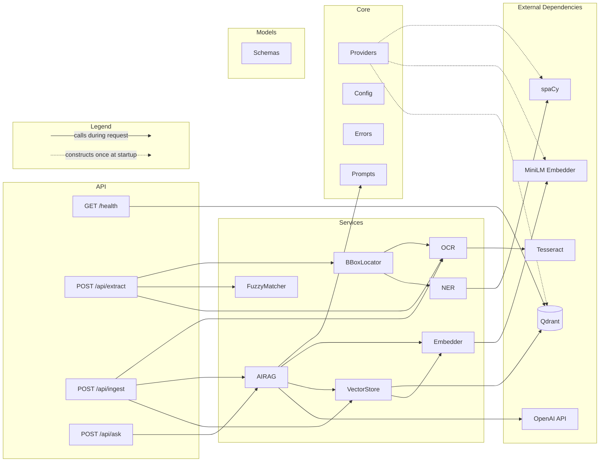
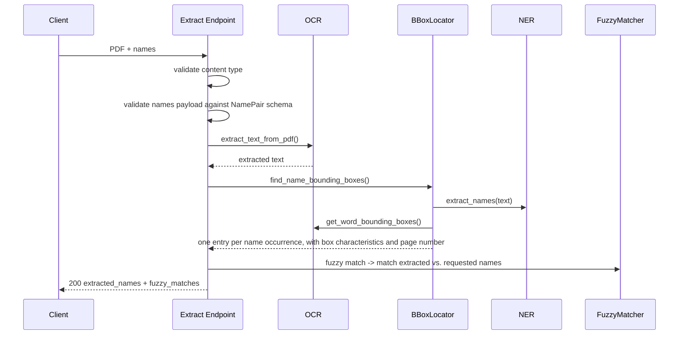
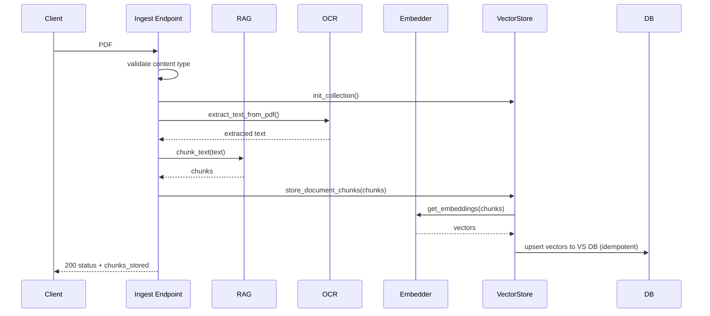
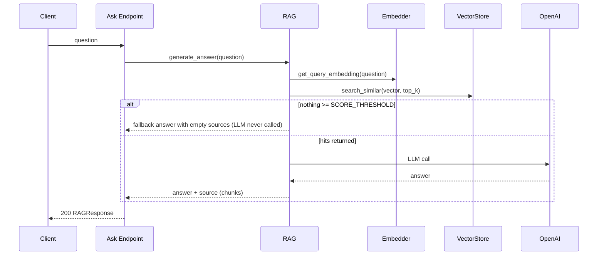

# Design Document
API with PDF name extraction using a NER model and RAG infrastructure with Qdrant vector database.
FastAPI application with an OCR -> NER -> fuzzy matching pipeline for `/api/extract`,
and a OCR -> chunk -> embed -> Qdrant -> OpenAI pipeline for `/api/ingest` + `/api/ask`.

## 1. Component Diagram
The codebase is composed of 3 layers:
1. **Core**: Contains the API's core definitions such as the config, prompt library, error library, and external model/clients.
    - *Note: External model and clients are constructed using `lru_cache` to optimize on expensive resource loading.* 
2. **Services**: Contains service/functionality classes for implementation pipelines.
3. **Models**: Contains Pydantic models that define structure contracts for different points in the API pipelines.

Transversal/Across the Board:
- `Config`: feeds all settings in models, parameters, hosts and timeouts
- `Error`: feeds all raised exceptions across the pipeline
- `Schemas`: feeds all contract points 

## 2. Sequence Diagrams

### /api/extract

### /api/ingest

### /api/ask

## 3. Technology Choices & Tradeoffs

| Choice | Why | Tradeoff accepted |
|---|---|---|
| FastAPI + Pydantic Schemas | Pydantic schemas allow transparent validation of inputs and outputs | Pipeline usage is synchronous even though it can be async, at a small scale implementation no issues |
| PyMuPDF + Tesseract OCR | Open source and no need for network access | Lower performance than bigger model on PDFs that are not easy to read |
| spaCy | Small and fast running on CPU | Trading speed and cost over LLM/transformer that is less error prone but more expensive. Structure of the NER service allows for a quick change |
| MiniLM sentence-transformers (384-dim) | Small and fast | Vs complex/larger models vector space computation loose accuracy and the results of embeddings will group information at a higher level |
| Qdrant | Specific vector DB, light and easy deployment in same docker stack as API | Simplicity in the operation due to embedded functionality in Qdrant against holding vectors inside of existing Postgres/SQL DB|
| OpenAI API via httpx | No SDK dependency | Not maintaning external dependency, but need to add all error handling. |
| uv + CPU-only torch pin | Pinning torch to the CPU index cuts the Docker image from 17.5 GB to 4.0 GB | No GPU usage with the current structure. Revise depending on the scale of implementation |
| NER + Embedding Models in Docker image | Reduce cold start in API calls and potential network error| Larger image and changing models requires a rebuild |

## 4. Scaling to 1000+ PDFs/hour

Scaling to 1000+ PDFs/hour depends on a handful of things which dictate the benefit to different additions/changes. These are pages per PDF, SLA on response, whether the 1000 PDFs/hour is a sustained number or behaves more like bursts of requests.

Changes/Implementations ranked by impact vs cost tradeoff:
1. **Single OCR Execution:** Currently OCR extraction is performed twice in the pipelines. Uused when extracting text and second use occurs computing bounding boxes location. OCR is run since it is a CPU heavy operation.
2. **Bypass OCR on Generated PDFs:** PDFs digitally generated contain a text layer that can be extracted using `fitz` without any need for OCR.
3. **OCR DPI Configuration**: By lowering the DPI at which the OCR operates the execution time of extraction gets reduced. Less pixels to scan means lower extraction time. This comes at the tradeoff of less accuracy.
4. **API Parallelization:** Since the API isn't holding any state, we can horizontally parallelize the API by building multiple different instances (Kubernetes). Tradeoff: each instance holds copy of models.
5. **OCR Extraction Queue:** Offload the OCR extraction to worker queue that gets autoscale as the queue length increases. Decouples arrival from processing, helps guard against bursts.
6. **PDF Page OCR Parallelization:** Paralleziation of PDF page OCR extraction which is currently sequential. Mostly for PDFs with large number of pages

## 5. Failure Modes & Mitigations
Services translate library exceptions into pipeline errors (`errors.py`). The endpoints map those to HTTP statuses with generic client messages, while the full detail goes to server logs.

| Failure | Behavior | Mitigation |
|---|---|---|
| Incorrect file type uploaded | 400 before any OCR work | Cheap content type check, then more expensive `%PDF-` bytes check and finally `OCRError` on open |
| Malformed names payload | 400 with expected format | Pydantic schema validation before the expensive pipeline runs |
| Qdrant down | 503 "temporarily unavailable" | `VectorStoreError` mapped and raised and docker compose has `restart: unless-stopped` |
| LLM Related errors: OpenAI down / 401 / 429 / timeout / incorrect response shape | 502 request bounded by `LLM_TIMEOUT_SEC` | `LLMError` mapped and raised, and the errors are logged |
| Missing `OPENAI_API_KEY` | Log at startup. `/ask` fails 502 while extract pipeline functional | Deliberate error handling to prevent entire app crash |

Deferred (not built): retry with backoff on OpenAI/Qdrant

## 6. LLM Routing Strategy
1. **Cheap:**: Heuristic based approach to try to get a sense of the query complexity/difficulty and route to different LLM spanning different levels of cost vs capacity/strength. Looking at the questions component such as:
- Interragition words (who, when, where, how) -> fast model
- Synthesis related words (why, how, compare, summarize, explain) -> medium model
- Number of entities/nouns the question contains - (this might requre more chunks to be "synthesized") -> big model
- Comparatives or aggregations (most, total, compared) - (this might requre more chunks to be "synthesized") -> big model

2. **Moderate:** Use vector similarity score and distributions as guiding principle.
- High top score = one vector most likely contains the answer -> fast model
- All vector scores are mid range = answer is most likely a combination of all the information -> medium/big model
- Top score close to threshold = information weakly realted, ideally new retreival with wider params to prevent bad answers

3. **Expensive:** Us LLM as a classifier for the complexity of the query and select the model based on the query type. This implementation comes at the cost of 2 LLM calls and added latency. In easy to answer questions there is no real benefit and just added cost, while complex ones do benefit from a better model. Mixture or a simple heuristic based approach an LLM classifier might help out in finding simple questions to save on the first LLM call.